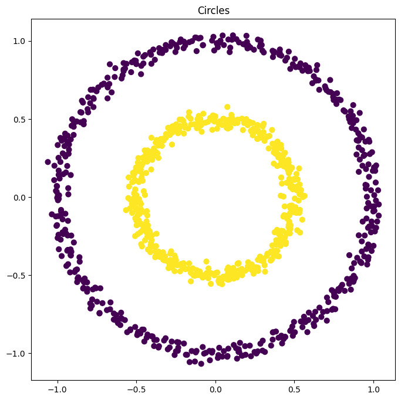
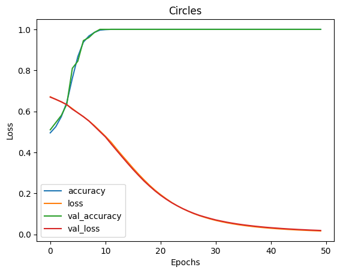
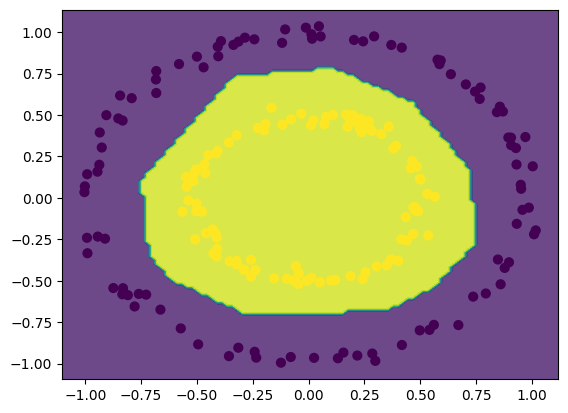

# Neural Network Training and Visualization

This project implements a simple Neural Network that trains on synthetic datasets and **visualizes** its learning process, inspired by the TensorFlow Playground website.

You can see how the model's **decision boundary** evolves and monitor **loss vs. epochs** during training.

## 📌 Project Features
- Build and train a custom neural network using TensorFlow/Keras
- Visualize decision boundaries between different classes
- Plot and analyze training and validation loss over time
- Evaluate model performance on unseen test data

## 🛠️ Technologies Used
- Python
- TensorFlow
- Keras
- NumPy
- Matplotlib
- Jupyter Notebook

## 📊 Visualizations

- Initial Data Scatter
- Decision Boundary Plot
- Loss vs Epochs Plot

## 📈 Results
- Final test accuracy: ~98%
- Smooth convergence without overfitting
- Correct decision boundary for non-linear datasets
